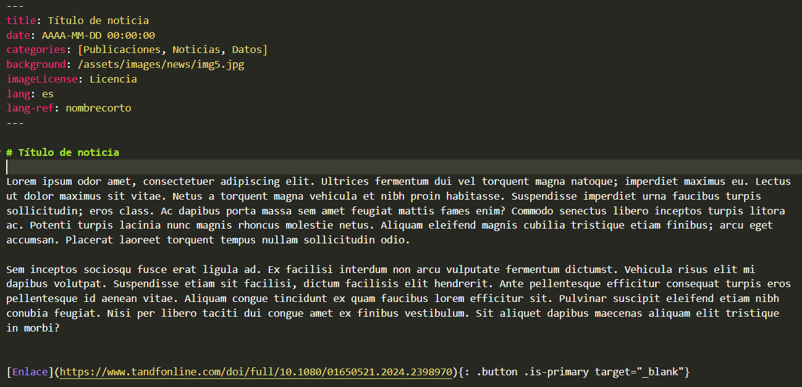

<!-- License badge example:  -->

# GBIF Hosted Portal: SIB Uruguay

This Jekyll website, **https://sibuy.ambiente.gub.uy/)**, makes use of a theme and biodiversity widgets developed by the GBIF network.

You can find information on editing this site and more on [gbif/hosted-portals](https://github.com/gbif/hosted-portals)

> Powered by [GBIF](https://www.gbif.org/)

# Documentación específica para el SIBUy

Se detallan los cambios y explicación de la estructura de carpetas que se está manejando para el portal.

Dentro de las carpetas del sitio, pueden encontrarse otros archivos README.md con explicación más específica.

## Sobre los archivos Markdown (Extensión .md)

Los archivos que tienen extensión md definen contenido visible en el portal. Para el SIBUy principalmente es para el contenido en el portal principal (página de inicio, recursos, noticias, y secciones adicionales).

Estos archivos se pueden crear todo lo que se necesite y en cualquier ubicación, pero se recomienda al menos que las páginas principales estén en la raíz del sitio y se creen carpetas para conjuntos de páginas que tengan alguna relación.

En general, cada archivo md está dividido en dos secciones:

1. Configuración (*Front Matter*), o las primeras líneas de los archivos md como bloque entre 3 caracteres guion (---) y que definen el layout (disposición de elementos), título, descripción para buscadores, uso de imágenes de apoyo entre otras opciones. Cada archivo md tiene una configuración mínima (layout, title y description) y otras de acuerdo con el layout seleccionado por página, como por ejemplo para noticias se tiene fecha y categoría. Se puede revisar la documentación de los [Hosted Portal](https://hp-theme.gbif-staging.org/) en la sección de Layouts para ver cuáles se tienen disponibles y las opciones del *Front Matter*.
2. Contenido, se desarrolla el contenido en lenguaje markdown, que son un conjunto de etiquetas predefinidas para manejar formato de texto, como negrilla, cursiva, etc., y además usar enlaces entre otras opciones. Más información en https://docs.github.com/es/get-started/writing-on-github/getting-started-with-writing-and-formatting-on-github/basic-writing-and-formatting-syntax. 

## Sobre los archivos yaml (Extensión .yml)

Archivos para configuración del sitio o de secciones de contenido: Se tiene principalmente:

1. [_config.yml](_config.yml), que define metadatos para el hosted portal como el título del sitio, mail de contacto, descripción del portal para posicionamiento en buscadores, el nombre de usuario para redes sociales a visualizar, uso de [analíticas de Google](https://analytics.google.com/) para seguimiento y conteo de visitas. Así como configuración del logo del sitio y colores.
2. Archivos yml dentro de la carpeta [_data](_data), donde se definen el pie de página en [footer.yml](_data/footer.yml), la barra de navegación en [_navigation.yml](_data/navigation.yml) y la estructura de la página de inicio del SIBUy en [_sections.yml](_data/sections.yml).

Los cambios a nivel de contenido serían principalmente para el pie de página y navegación.

## Sobre la traducción de páginas

Para la traducción en los Hosted Portal se utilizan dos esquemas:

1. Traducción de texto en el archivo [translations.yml](_data/translations.yml), que mapea llaves de texto con sus traducciones en los idiomas definidos para el portal (español/inglés actualmente). Por ejemplo, se puede indicar la llave "okButton" para que el Hosted Portal al traducir el texto sea OK, Aceptar, Accept, u otros idiomas.
2. Archivos con contenido adaptado para cada idioma que se use en el portal. En este caso se duplica el contenido de un archivo markdown y se traduce al idioma que se necesite.

Para el SIBUy, se usa principalmente el esquema de archivos adaptados, es decir, para cada página del portal en idioma principal (español) existe una página traducida al idioma secundario (inglés), por lo que se debe tener en cuenta, que si se presenta un cambio en alguna de las páginas el sitio se *debería* llevar ese cambio también a su versión traducida. En la sección 

## Sobre el layout de las páginas

Cada página en markdown en su configuración de *front matter* define un layout o estructura de página. Para la mayoría de las páginas del portal se usa *default*, el cual permite, o no, utilizar una imagen de encabezado y contenido centrado, otro tipo es *home* que define una estructura de secciones para la página de inicio. Uno específico es *post* para las noticias en la [sección](_posts) correspondiente. No son las únicas opciones y se pueden explorar a la documentación del [hosted portal base](https://hp-theme.gbif-staging.org/layout/page)

## Estructura de archivos

A 2024-11-18 se tiene la siguiente estructura de archivos:

Se dará una descripción general del contenido de las carpetas. Se listan de acuerdo con la funcionlidad con respecto a la raíz del sitio.

### Raíz (HP-SIBUY)

Es la raíz del sitio, donde se encuentran las carpetas y archivo del Hosted Portal. A este nivel se encuentran los siguientes markdown:
- 404: Es el contenido cuando se intenta acceder a una dirección que no tenga un archivo md asociado.
- about: Contenido de la página de acerca del SIBUy
- faq: Contenido de la sección de preguntas frecuentes
- home: Definición de la página de inicio del portal. Se usa un layout home compuesto por otras secciones, las cuales están definidas en el archivo [sections.yml](_data/sections.yml) dentro de la carpeta [_data](_data). Aclarar que el contenido de la página de inicio, más allá de la imagen y botones sobre la imagen se define en [sections.yml](_data/sections.yml).

Otros archivos como collection.md, dataset.md, institution.md y ocurrence.md son de ayuda para definir las rutas de consulta de datos para colecciones, conjuntos de datos y ocurrencias de especies. Es preferible no modificar estos archivos ya que un cambio implicaría hacer otros cambios el archivo de configuración [_config.yml](_config.yml).

Otro archivo es privacy.md, el cual permite definir el texto sobre uso y privacidad de datos, si se habilita la opción en [_config.yml](_config.yml).

### Resources

Esta carpeta se encuentran las páginas con el contenido para los siguientes elementos. Se utiliza la navegación por menú para indicar la página dentro de la carpeta [resources](resources) con el contenido:

- Datos
    - Datos de ADN: [barcoding.md](resources/barcoding-uy.md)
- Publicar
    - Cómo publicar: [publisher-registry.md](resources/publisher-registry.md)
- Recursos
    - Estándar Darwin Core: [darwin-core.md](resources/darwin-core.md)
    - Plantillas Darwin Core: [data-publishing.md](resources/data-publishing.md)
    - Calidad de datos: [data-quality.md](resources/data-quality.md)

    ### en (carpeta de traducciones)

    En esta carpeta se almacenan las páginas traducidas, respetando la estructura de directorios del sitio. Es decir, si tengo una página en la raíz del (HP-SIBUY), como puede ser [about.md](about.md), dentro de la carpeta "*en*" existirá la versión traducida, con el mismo nombre, pero dentro de la carpeta de traducción [en/about.md](en/about.md).
    
    Para el caso de la carpeta [resources](resources) se tiene su traducción dentro de la carpeta dentro de [en/resources](en/resources). Por ejemplo, si se quiere cambiar el contenido de Datos de ADN se debe hacer en [en/resources/barcoding.md](en/resources/barcoding-uy.md)

    En general, si se hace un cambio en alguna de las páginas del sitio, se debería hacer el cambio en la traducción.

### Assests

En la carpeta de [assets](assets) se creó la carpeta [images](assets/images) para las imágenes de apoyo del contenido del portal. Dentro de la carpeta se encuentran imágenes usadas para diferentes páginas dentro del portal, así como 3 carpetas usadas para agrupar contenido:

- icons: íconos utilizados para la sección de estadísticas de la página de inicio del SIBUy
- logos: Logos de las entidades que aparecen en el pie de página del sitio.
- news: imágenes utilizadas para las noticias dentro del sitio.

Se sugiere utilizar esta estructura, para facilitar la vinculación de imágenes a las páginas.

Por último, se recomienda no utilizar espacios ( ), ni caracteres como &, %, /, (, ), # para los nombres de imágenes. En cuanto al uso de mayúsculas y minúsculas, se suguiere que todos los nombres queden en minúscula, tanto el nombre como la extensión del archivo (.png, .jpg), esto con el fin de evitar ambigüedad.

Dentro de la carpeta [assets](assets) podrían crearse otras carpetas por ejemplo, para almacenar archivos, u otro contenido.

### _post

Contiene las [noticias](_posts) que se muestran tanto en la página de inicio, como en el link de Noticias del portal.

Dentro de la carpeta están las noticias, las cuales se deben nombrar iniciando con fecha de publicación en formato AAAA-MM-DD (año a 4 dígitos, mes y día a 2, por ejemplo: 2024-02-15) y posterior el nombre corto de la noticia (en cualquier idioma), sin espacios entre todo el texto usando guion como carecter concatenador, por ejemplo: 2024-05-04-noticia-nueva-md.

[!WARNING]  
Es importante que los archivos se encuentren con el formato de fecha-nombre, esto con el fin que el portal muestre de manera cronológica, desde la más reciente, las noticias.

Cada noticia puede tener una traducción, que se debe guardar dentro de [_post/en](_posts/en). Los archivos deben tener el mismo nombre. Se puede copiar la [plantilla de noticias](docs/AAAA-MM-DD-nombre-noticia.md) que se encuentra dentro de la carpeta de [docs](docs), cambiando la siguiente información dentro del *front matter*:

- title: Incluir el título de la noticia.
- date: Cambiar a la fecha de publicación. Se puede usar hora de publicación, pero se sugiere no cambiar.
- categories, se pueden incluir para agrupar noticias. No se tiene un vocabulario controlado, por lo que se puede agregar cualquier texto y cantidad. Tener en cuenta que se debe separar por coma (,).
- background: Enlace de la imagen de apoyo a la noticia, puede ser alguna que se suba a la carpeta [assets/images/news](assets/images/news), o un enlace https desde internet.
- imageLicense: Texto de licencia de la imagen. Se sugiere al menos colocar una licencia y reconocimiento.
- lang: Indica el idioma de la noticia, por defecto español (es). Para noticias en inglés se debe cambiar a *"en"*
-lang-ref: Es un nombre corto, preferiblemente sin espacios y que debe ser el mismo tanto para la noticia en español como en inglés.

En cuanto al contenido, se recomienda utilizar el mismo título de noticia del *front matter* para el título. Por último, se deja un ejemplo de enlace si se desea enlazar a otro contenido por fuera del SIBUy, sólo se debe cambiar lo que en el enlace aparezca como link (https) y que se encuentra dentro de paréntesis. Lo que se encuentra dentro de paréntesis cuadrados [] es el nombre que aparecerá visible en el enlace.

### _data

La carpeta [_data](_data) maneja la siguiente información:

- [_footer.yml](_data/footer.yml). Contiene la información del pie de página de portal. A diferencia de los archivos markdown (md), estos son archivos de configuración, por lo que el contenido se debe adecuar a los parámetros de presentación. En el caso del pie de página se definen columnas que son visualizadas hasta cuatro por fila. Para el SIBUy cada columna es una entidad con el logo y enlace, y la segunda fila con una única columna con información de contacto.
- [_navigation.yml](_data/navigation.yml). Contiene la configuración del menú de navegación. Se manejan pares de llaves text para indicar el texto que aparece en el menú y los elementos del menú.
- [_sections.yml](_data/sections.yml). Define el layout de la página de inicio definido a 3 secciones: Stats para la fila de estadísticos del portal, Welcome para el texto y imagen de presentación luego de los estadíticos y checklist para las fichas de presentación de los 2 listados de especies que se muestran en el home. Este archivo permite definir las secciones, pero se deben incluir en el [home](home.md) (tanto en español como en inglés) para que sean visibles.
- [_languages.yml](_data/languages.yml). Define el listado de idiomas usado en el selector. Se pueden incluir nuevos idiomas, pero además se deberan crear las carpetas de traducciones correspondientes.

También está [_translations.yml](_data/translations.yml) que se usa para el método de traducción por llaves. No se utiliza para SIBUy más allá de algunos textos en el banner de privacidad.

En cuanto a la traducción de este contenido, está la carpeta [_data/en](_data/en) con los mismos nombres de archivos, pero con el contenido traducido al idioma.

### Otras carpetas
También están _include, _sass y docs. Las dos primeras son para opciones de configuración avanzada de las páginas de consulta, mientras que [docs](docs) es una carpeta para almacenar imágenes de apoyo de esta documentación, así como plantilla de noticias.

